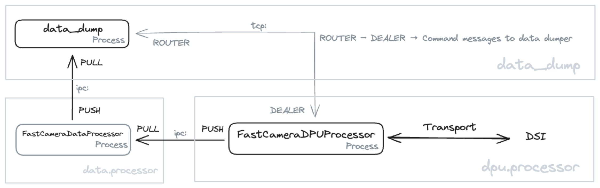

[#data-dumper]
== The Data Dumper

We have some problems with performance in reading out the N-FEE when we request both sides of a CCD. The reason for that is probably a series of events, such as waiting for a busy storage manager, garbage collection, data processing, etc. When starting to develop the code for the fast camera, we want to avoid these performance problems as much as possible and we made a number of decisions that are explained below.

- The DPU Processor should not have to wait for confirmation of the storage manager when saving data. So, we should change from a REQ-REP protocol to a PUSH-PULL protocol.
- The DPU Processor shall do less processing of information before sending messages to other components. Actually, the process that reads out the spacewire data packets from the F-FEE shall be as simple as possible and delegate all possible tasks to other processes.
- Communication between processes can be optimised using inter-process communication (IPC) instead of Transmission Control Protocol (TCP).

So, we started out designing the new F-DPU Processes.

There are two main problems that we identified with the Data Storage. (1) The Storage Manager forms a bottleneck handling all data that is generated by the system, not only writing science data to the HDF5 files, but also handling (and duplicating) all housekeeping and auxiliary data that is generated by all the devices used during the test. (2) Using the request-reply (REQ-REP) protocol, the process that generates the data and sends it to the storage manager has to wait for a reply from the Storage Manager with a confirmation of the data being written properly. This might lead to a delay when the Storage manager is very busy writing information to different files and formats.

We decided to keep the functionality of the Storage Manager as it is, don't touch it since it is still used for all N-CAM activities. In addition, we will build a new process that will only handle the F-FEE HDF5 data from the F-DPU Processor. That new process we call the _Data Dumper_ (`data_dump`). All data that we retrieve from the F-FEE will be sent from the F-DPU Processor to the data dumper using a PUSH-PULL protocol. This ZeroMQ message protocol can push messages to multiple workers, but we will only connect with one worker, i.e. the data dumper.

Our seconds design point above says the F-DPU Processor shall do as few processing as possible and delegate those tasks to other processes. The reason is to make sure the F-DPU Processor can readout the F-FEE data fast enough to avoid any buffer overflow errors. For that reason we put a process in between the F-DPU Processor and the data dumper which will take over the identification of data packets, and processing those packets before they are sent to the data dumper. Communication between the F-DPU Processor and the new data processor is also based on the PUSH-PULL message protocol.

It's time to put that into a diagram in the hope it will clarify. Don't worry, we will talk you trough it.

The figure above contains the three processes described above, the F-DPU (FastCameraDPUProcessor), the data processor (FastCameraDataProcessor) and the data dumper (data_dump). The communication between these processes is based on the ZeroMQ PUSH-PULL protocol. Since these processes always run on the CGSE server, we use the faster inter-process communication (IPC) instead of the transmission-control protocol (TCP). We see that data is pushed from the F-DPU to the Data Processor to the data dumper. The F-DPU Processor gets the data from the F-FEE, so there is transport of data and information between the F-DPU and the DSI, which is the SpaceWire interface connected to the F-FEE.

Of course, the data dumper shall also be able to retrieve commands, mainly from the F-DPU, to synchronise data flow or update configuration settings. This is done through the ZeroMQ DEALER-ROUTER protocol which allows to send commands to the data dumper and request a return value only when needed. For example, if the data dumper needs to update its Setup to the latest version, you wouldn't require a reply when you send a `reload-setup` command. On the other hand, if you request status information from the data dumper you do expect a reply.

=== The data flow

This section explains what kind of data the data dumper receives and how this is handled. All data is stored into an HDF5 file. The format of this file is explained in the https://ivs-kuleuven.github.io/plato-cgse-doc/asciidocs/icd.html#hdf5-format[CGSE ICD] [PLATO-KUL-PL-ICD-0002] section 4.2.

Timecode::
The timecode is an integer between 0 and 63 and it is sent by the F-FEE immediately after the reception of a synchronisation pulse. The timecode marks the start of a readout cycle. So, when the data dumper receives a timecode, it closes its current HDF5 file and creates a new HDF5 file. The HDF5 files are created in the `daily/YYYYMMDD` folder at the location given by the `PLATO_DATA_STORAGE_LOCATION` environment variable. An example name for an HDF5 file that was created on our system that was connected to the EM in Leuven: `/data/KUL/daily/20241007/20241007_KUL_F-FEE_SPW_00042.hdf5`.
+
Remember, each timecode creates a new HDF5 file. That is every 2.5 seconds.

Housekeeping Packets::
The data dumper receives housekeeping packets for the DEB and the active AEBs. This housekeeping is only retrieved when the F-FEE is actually sending out image data. The housekeeping is stored in the same group as its image data (see further). The dataset names are `hk_aeb` and `hk_deb`.

Housekeeping Data::
The first thing the F-DPU Processor does when it receives a timecode, is requesting the register map and the housekeeping data from the DEB and all AEBs. The difference from housekeeping _packets_ that are sent by the F-FEE is that housekeeping _data_, that is retrieved by RMAP commanding, doesn't have a packet header. The housekeeping data is saved in the group `hk-data` and contains the datasets 'DEB', 'AEB1', 'AEB3', 'AEB3', and 'AEB4' and you should find this in every single HDF5 file.

Register Map::
The register map, which is the configuration memory area of the F-FEE, is retrieved from the F-FEE by the F-DPU using a few RMAP memory read requests. The register map is stored in the HDF5 file in a dataset named 'register'. Each HDF5 file shall have this dataset, and it contains the configuration as was commanded and as it will be active starting on the next timecode/HDF5 file.

Commands::
The data dumper also retrieves all commands that have been send to the F-FEE with their arguments. This information is stored in the group `commands`. The first six commands will always be `command_sync_register_map()`, `command_deb_read_hk()`, and `command_aeb_read_hk('AEB1')` for each AEB.

CCD Image data::
When the F-FEE is configured in science mode (DEB=FULL_IMAGE, AEBx=IMAGE and DTC_IN_MODE set accordingly), the data dumper will receive all image data as SpaceWire data packets, each containing the readouts of one row of the CCD. All these packets are stored in the group data which is a subgroup of `AEBx-S` where 'x'=1,2,3,4 and 'S'='E' or 'F'. For example, when image data is sent for the E-side of AEB2, the group `AEB2_E` will contain a group `data` with all the image data packets, and also the groups `hk_deb` and `hk_aeb` (see above). In the default readout mode, there shall be 2260 datasets with image data inside the `data` group.
+
When image data is available in the HDF5 file, the File group will have the attribute `has_data` set to True, if no image data was sent, this attribute will be False.
+
Also the `data` group has two attributes attached when image data is available, i.e. `ccd_side` and the `overscan_lines`
+
On the F-FEE EM we suffered from buffer overflow errors when receiving image data, resulting in corrupt data packets being sent to the data dumper. These packets are stored in the group `spw-data`. What we saw for the EM is that these corrupt packets were sometime longer, sometimes shorter than the valid data packets, but the amount of packets matched the amount of missing packets in the `data` group.

Observation ID::
When an observation is started, the OBSID will be sent to the data dumper. The OBSID will be saved in the `obsid` group.

=== Commanding the data dumper

The data dumper listens to commands coming in on the `DATA_DUMPER.COMMANDING_PORT`. A number of the available commands are also provided as terminal commands. That is described for each of the commands below.
The following commands are currently recognised:

HELO::
This command is used to register a process that wants to communicate with the data dumper. The data dumper keeps a registry of all registered processes. The command expects the name of the process that registers. A reply is sent on request.

BYE::
This command is used to unregister from the data dumper. No reply is sent.

LOCATION::
This command will set the new location for the HDF5 files after checking if the location exists and is writable. An acknowledgment will be sent on request.
+
The corresponding terminal command: `data_dump set-location <fully qualified folder name>`

RELOAD-SETUP::
This command is used to instruct the data dumper to reload the latest Setup from the configuration manager. An acknowledgment will be sent on request.
+
The corresponding terminal command: `data_dump reload-setup`

STATUS::
This command requests status information from the data dumper. The reply string will look like this:
+
----
Data Dumper:
  Version             : 0.4.0
  Hostname            : 10.33.179.160
  Commanding port     : 30305
  Monitoring port     : 30304
  Data dump port      : 30104
  Data location       : /data/KUL/daily/20241008
  Site ID             : KUL
  Setup loaded        : 00035
  Scheduler           : ['Scheduler.set_new_location → 2024-10-09 00:02:00+00:00']
  Dealers             : DATA-DUMP-STATUS, F-DPU
----
+
The corresponding terminal command is: `data_dump status`

QUIT::
This command will terminate the data dumper process. All open files and connections will be closed and the scheduler will be stopped. This command will only be accepted if it is sent by a registered process. No reply is sent.
