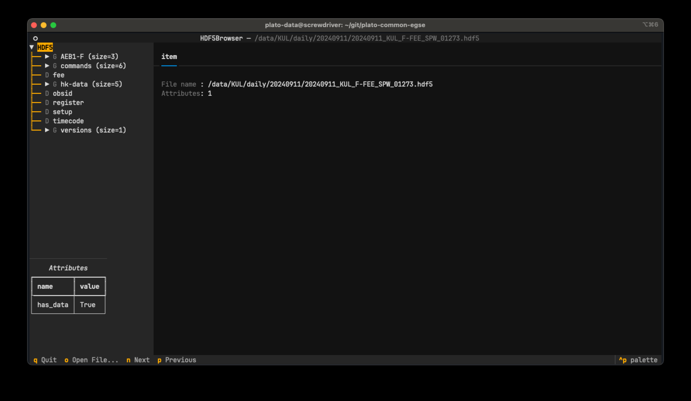
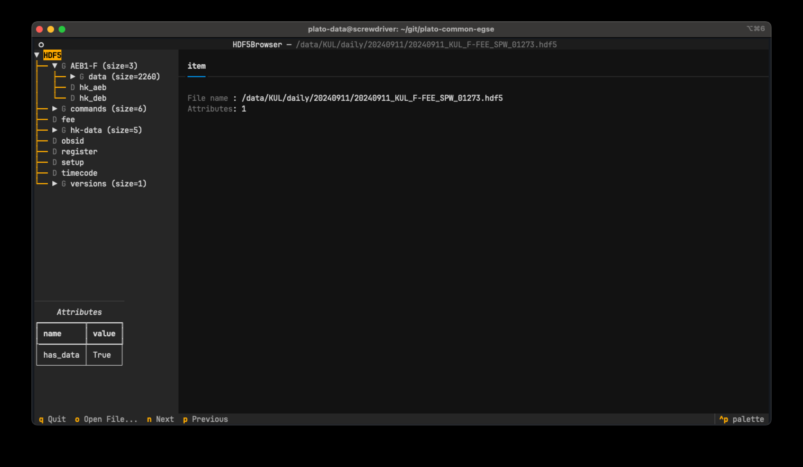
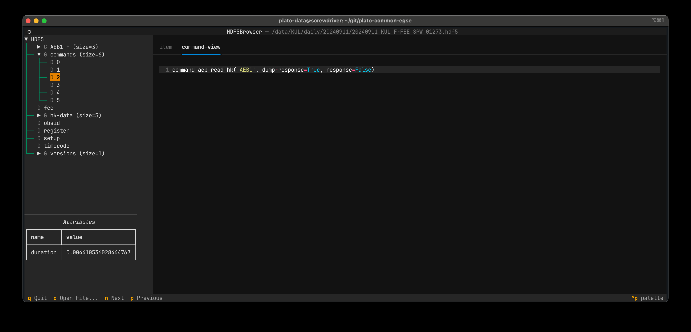
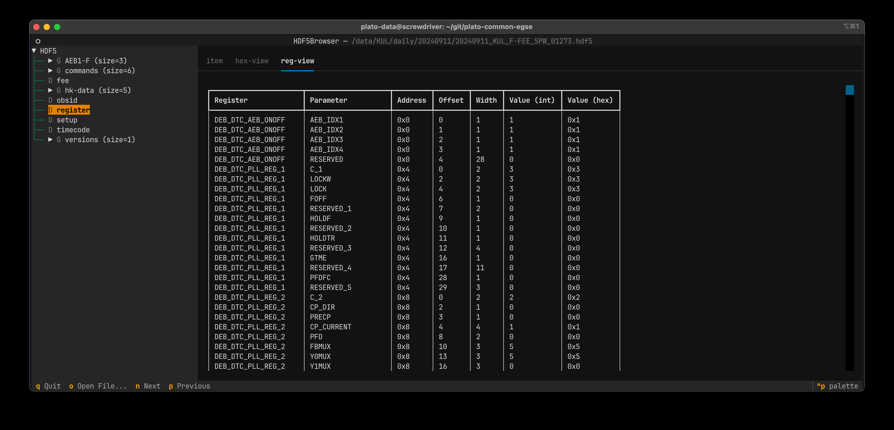
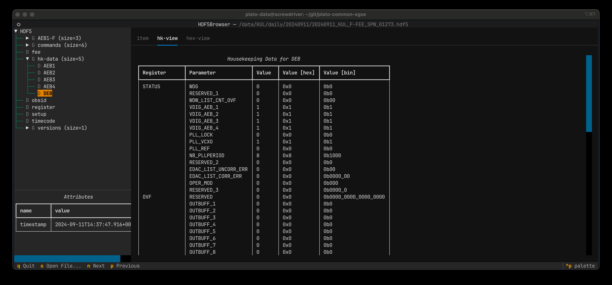
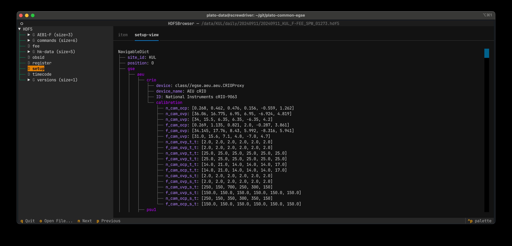
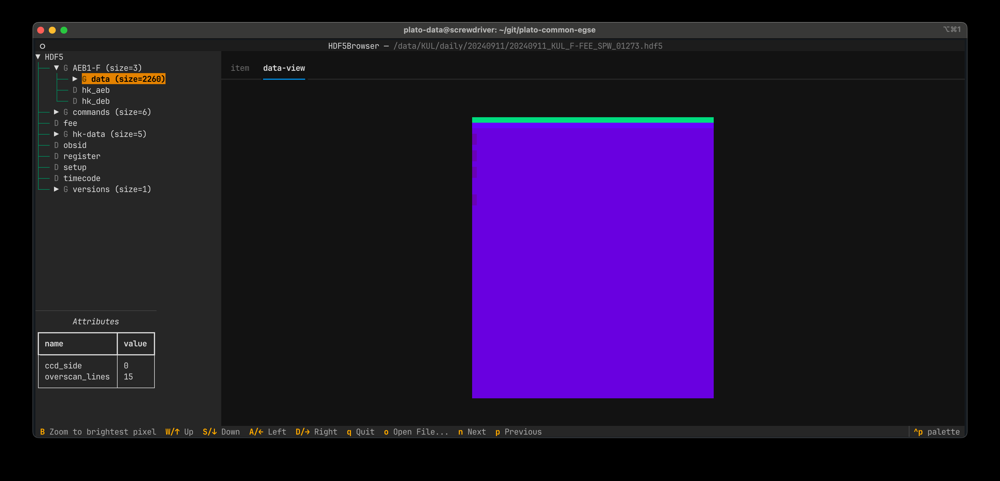
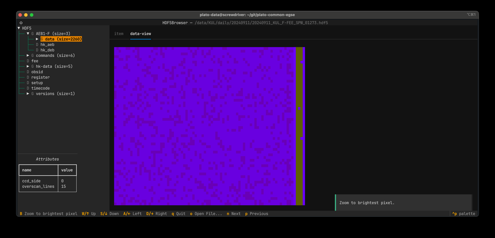
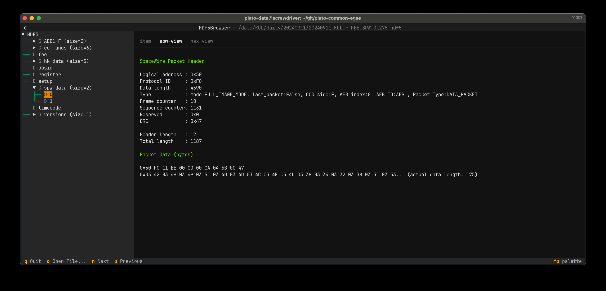
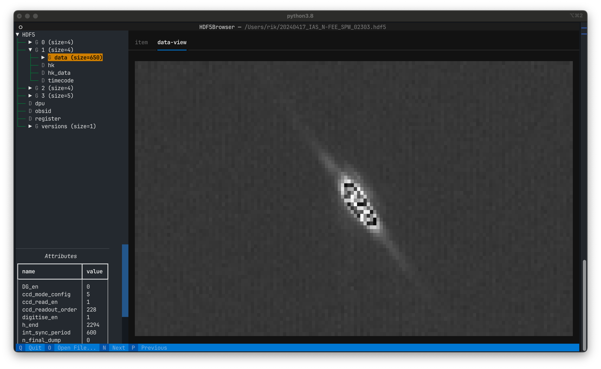

[#hdf5-format]
== The format of the HDF5 files

The HDF5 files contain the raw data that is read out from the camera through the spacewire interface that is connected to the front-end-electronics (FEE).

In contrast to the FITS files, which are organised around the image data, the HDF5 files are organised around the readout sequence and the telemetry that is sent out by the camera. Each HDF5 file contains exactly one readout sequence, i.e. four frames in external sync mode and one frame for internal sync. The data is not processed, but the raw data packets are saved as an Numpy array of type `uint8`, all values are unsigned integers of 8 bits, i.e. a byte.

Inspecting the HDF5 files can be done with the `h5py` module or you can use the CGSE module `egse.h5` which provides convenience functions to work with HDF5 files. We normally use the CGSE module to explore the HDF5 files, but will provide equivalent code for inspection with the `h5py` module where possible.

[tabs]
======
egse.h5::
+
----
>>> from egse import h5
----
h5py::
+
----
>>> import h5py
----
======

[#hdf5-format-version]
=== HDF5 format version

Each HDF5 file generated by the storage or the data dumper has a group `/versions/format_version` which contains two attributes, `major_version` and `minor_version`. In the following example, we see that the current version number for an N-FEE HDF5 file is 2.6 and for an F-FEE HDF5 file is 3.0. The major version will not change anymore, we fixed it to `major_version=2` for N-FEE and `major_version=3` for F-FEE. Only the minor version will increase when format changes are introduced in the HDF5 file.

[tabs]
======
N-FEE::
+
----
>>> from egse import h5
>>> h5_fd = h5.get_file('20240606_CSL2_N-FEE_SPW_00001.hdf5', mode='r')
>>> h5.get_attributes(h5_fd['/versions/format_version'])
{'major_version': 2, 'minor_version': 6}
----
F-FEE::
+
----
>>> from egse import h5
>>> h5_fd = h5.get_file('20240605_KUL_F-FEE_SPW_00803.hdf5', mode='r')
>>> h5.get_attributes(h5_fd['/versions/format_version'])
{'major_version': 3, 'minor_version': 0}
----
======

Since the format and content of the N-FEE and F-FEE HDF5 files are quite different, we have split the description in two sections below. We will go through the different groups, datasets, and attributes of each of these files, explain how to extract the information from the HDF5 file and what the content is. Since some of you are more used to the `h5py` package we will try to extract and visualize the data using both the `egse.h5` as the `h5py` package. A third visualisation is with the `h5tui` app, which is a generic HDF5 viewer (a terminal app) that was developed for this project. We will use that with the F-FEE HDF5 files.

[#hdf5-n-fee-inspection]
=== Inspection of an N-FEE HDF5 file

This section describes the format and content of an N-FEE HDF5 file.  For information about the HDF5 file for the F-FEE, checkout <<hdf5-f-fee-inspection>>.

Let's take an example file from IAS taken on 7th February 2023. The file is loaded with the `h5.get_file()` function and we can visualize the top level structure as follows:

[tabs]
======
egse.h5::
+
----
>>> h5_fd = h5.get_file("20240329_CSL2_N-FEE_SPW_00017.hdf5")
>>> h5.show_file(h5_fd)
[G] 0
[G] 1
[G] 2
[G] 3
[D] dpu (104 bytes)
[D] fee (104 bytes)
[D] obsid (104 bytes)
[D] register (2.109 KB)
[G] versions
Total size of Group = 159.598 MB
Total size of attributes: 0 bytes
----

h5py::
+
----
>>> h5_fd = h5py.File("20230207_IAS_N-FEE_SPW_06174.hdf5")
>>> [x for x in h5_fd]
['0', '1', '2', '3', 'dpu', 'fee', 'obsid', 'register', 'versions']
----

======
We can see that there are five top-level groups and four datasets. This is data taken in external sync mode, so we have four readouts per cycle. The data from each readout is in the groups 0, 1, 2, and 3. These numbers correspond to the frame number. Each of these groups has the following structure:

[tabs]
======
egse.h5::
+
----
>>> h5.show_groups(h5_fd["/0"], max_level=1)
[G] data
[D] hk (266 bytes)
[D] hk_data (256 bytes)
[D] timecode (104 bytes)
Total size of Group = 39.899 MB
----
h5py::
+
----
>>> [x for x in h5_fd["/0"]]
['data', 'hk', 'hk_data', 'timecode']
----
======

The `data` group contains all the SpaceWire packets that have image data, i.e. normal data packets and overscan packets. The `data` group also has the following attributes that are used to decode the SpaceWire packets into image data arrays. We will describe the `data` groups into more detail later in this section.

[tabs]
======
egse.h5::
+
----
>>> h5.show_attributes(h5_fd["/0/data"])
DG_en: 0 (32 bytes)
ccd_mode_config: 5 (32 bytes)
ccd_read_en: 1 (32 bytes)
ccd_readout_order: 228 (32 bytes)
digitise_en: 1 (32 bytes)
h_end: 2294 (32 bytes)
int_sync_period: 2500 (32 bytes)
n_final_dump: 0 (32 bytes)
sensor_sel: 3 (32 bytes)
sync_sel: 0 (32 bytes)
v_end: 4539 (32 bytes)
v_start: 0 (32 bytes)
Total size of attributes: 384 bytes
----
h5py::
+
----
>>> [x for x in h5_fd["/0/data"].attrs]
[
    'DG_en',
    'ccd_mode_config',
    'ccd_read_en',
    'ccd_readout_order',
    'digitise_en',
    'h_end',
    'int_sync_period',
    'n_final_dump',
    'sensor_sel',
    'sync_sel',
    'v_end',
    'v_start'
]
----
======

The two datasets in group `'/0'` contain the timecode and the housekeeping information that is sent on every sync pulse. The `timecode` dataset contains the timecode itself and the timestamp when this timecode was received by the DPU Processor. Remember the timecode is an integer from 0 to 63. The `timecode` dataset is an array with one integer element, the timestamp is an attribute of the `timecode` dataset. The `timecode` dataset and the timestamp can be visualised as follows.

[tabs]
======
egse.h5::
+
----
>>> h5.get_data(h5_fd["/0/timecode"])
array(53)
>>> h5.get_attribute_value(h5_fd["/0/timecode"], "timestamp")
'2023-02-07T15:13:10.397+0000'
----
h5py::
+
----
>>> h5_fd["/0/timecode"][()]
53
>>> h5_fd["/0/timecode"].attrs["timestamp"]
'2023-02-07T15:13:10.397+0000'
----
======

The raw content of the `hk` dataset can be shown as follows. The `hk` dataset has no attributes currently.
[tabs]
======
egse.h5::
+
----
>>> h5.get_data(h5_fd["/0/hk"])
array([ 80, 240,   0, 144,   5, 130,  24,  29,   0,   0, 128,   0, 128,
         0, 128,   0, 128,   0, 128,   0, 128,   0, 127, 255, 127, 255,
       127, 255, 127, 255, 127, 255, 127, 255, 127, 255, 127, 255, 127,
       255, 128,  21,   0,   0, 128,  88, 128,  87, 128,  88, 128,  88,
       128,  88, 128,  87, 128,  88, 128,  88, 128,  85, 128,  86, 128,
        86,  57, 191, 252, 138, 250, 233, 128,  87, 128,  88,  26, 159,
       231,  93,  25, 121, 231, 110,  26, 140, 223,  53,  26, 128,  83,
       191,  64, 186,   7,  68, 251, 124,  58, 236,  10, 181,   0,   0,
       128,  87, 128,  88, 148, 193, 128,  85, 128,  89, 148, 193, 128,
        88, 128,  88, 148, 186, 128,  86, 128,  89, 148, 202, 128,  86,
       128,  87, 128,  85, 128,  89, 128,  90,   0,  53,   0,   1,  24,
        29,   0,   0,   0,   0,   0,   0,   0,   0,   0,  24], dtype=uint8)
----
h5py::
+
----
>>> h5_fd["/0/hk"][()]
array([ 80, 240,   0, 144,   5, 130,  24,  29,   0,   0, 128,   0, 128,
         0, 128,   0, 128,   0, 128,   0, 128,   0, 127, 255, 127, 255,
       127, 255, 127, 255, 127, 255, 127, 255, 127, 255, 127, 255, 127,
       255, 128,  21,   0,   0, 128,  88, 128,  87, 128,  88, 128,  88,
       128,  88, 128,  87, 128,  88, 128,  88, 128,  85, 128,  86, 128,
        86,  57, 191, 252, 138, 250, 233, 128,  87, 128,  88,  26, 159,
       231,  93,  25, 121, 231, 110,  26, 140, 223,  53,  26, 128,  83,
       191,  64, 186,   7,  68, 251, 124,  58, 236,  10, 181,   0,   0,
       128,  87, 128,  88, 148, 193, 128,  85, 128,  89, 148, 193, 128,
        88, 128,  88, 148, 186, 128,  86, 128,  89, 148, 202, 128,  86,
       128,  87, 128,  85, 128,  89, 128,  90,   0,  53,   0,   1,  24,
        29,   0,   0,   0,   0,   0,   0,   0,   0,   0,  24], dtype=uint8)
----
======
There is also a `hk_data` dataset which contains the housekeeping data that was requested from the FEE after all image data has been transmitted. The difference between the `hk` and the `hk_data` is that the former is a `HousekeepingPacket` object, while the latter is a `HousekeepingData` object. The reason for this difference is that the `hk` is a SpW packet that is always sent by the FEE after the timecode, the `hk_data` is the memory requested that contains the housekeeping information, no SpW packet was every constructed for it (as it was sent in an RMAP read request reply).

NOTE: So, why do we need this additional `hk_data`? This was a request by ESA, the housekeeping after all data is sent contains valuable information about the FEE during the transmission of the data, e.g. the error flags reflect possible errors that occurred during the transmission.

The CGSE provides a module to inspect and work with PLATO SpaceWire packets. The above housekeeping packet can be inspected using the `HousekeepingPacket` class from the `egse.spw` package:
[tabs]
======
egse.h5::
+
[%nowrap]
----
>>> from egse.spw import HousekeepingPacket
>>> hk_data = h5.get_data(h5_fd["/0/hk"])
>>> hk = HousekeepingPacket(hk_data)
>>> print(hk)
HousekeepingPacket:
  Logical Address = 0x50
  Protocol ID = 0xF0
  Length = 144
  Type = mode:FULL_IMAGE_MODE, last_packet:True, CCD side:E, CCD number:0, Frame number:0, Packet
Type:HOUSEKEEPING_DATA
  Frame Counter = 16
  Sequence Counter = 0
  Header = 50 F0 00 90 05 82 00 10 00 00
  Data HEX = 00 00 00 00 00 00 00 00 00 00 00 01 7F FF 7F FF 7F FF 7F FF 7F FF 7F FF 7F FF 7F FF 7F FF 80 15 80 57 80 58 80 57 80 58 80 58 80 58 80 57 80 58 80 58
  Data ASC = .................................W.X.W.X.X.X.W.X.X----
----
h5py::
+
In this case only the retrieving of the `hk_data` is different:
+
----
>>> hk_data = h5_fd["/0/hk"][()]
----
======
Inspecting the housekeeping data, can be done as follows, please note that the `HousekeepingData` class is dependent on the camera type, for the N-FEE, the class is loaded from `egse.dpu.npdu.dpu`.

----
>>> from egse.dpu.ndpu.dpu import HousekeepingData
>>> hk_data = h5.get_data(h5_fd["/0/hk_data"])
>>> hk_data = HousekeepingData(hk_data)
>>> print(hk_data)
                       Housekeeping Data
┏━━━━━━━━━━━━━━━━━━━━━━━┳━━━━━━━━┳━━━━━━━━┳━━━━━━━━━━━━━━━━━━━━┓
┃ Parameter             ┃ Value  ┃ Value  ┃ Value              ┃
┡━━━━━━━━━━━━━━━━━━━━━━━╇━━━━━━━━╇━━━━━━━━╇━━━━━━━━━━━━━━━━━━━━┩
│ TOU_SENSE_1           │ 0      │ 0x0    │ 0b0                │
│ TOU_SENSE_2           │ 0      │ 0x0    │ 0b0                │
│ TOU_SENSE_3           │ 0      │ 0x0    │ 0b0                │
│ TOU_SENSE_4           │ 0      │ 0x0    │ 0b0                │
│ TOU_SENSE_5           │ 0      │ 0x0    │ 0b0                │
│ TOU_SENSE_6           │ 1      │ 0x1    │ 0b1                │
│ CCD2_TS               │ 32767  │ 0x7fff │ 0b111111111111111  │
│ CCD3_TS               │ 32767  │ 0x7fff │ 0b111111111111111  │
│ CCD4_TS               │ 32767  │ 0x7fff │ 0b111111111111111  │
│ CCD1_TS               │ 32767  │ 0x7fff │ 0b111111111111111  │
│ PRT1                  │ 32767  │ 0x7fff │ 0b111111111111111  │
│ PRT2                  │ 32767  │ 0x7fff │ 0b111111111111111  │
│ PRT3                  │ 32767  │ 0x7fff │ 0b111111111111111  │
│ PRT4                  │ 32767  │ 0x7fff │ 0b111111111111111  │
│ PRT5                  │ 32767  │ 0x7fff │ 0b111111111111111  │
│ ZERO_DIFF_AMP         │ 32789  │ 0x8015 │ 0b1000000000010101 │
│ CCD2_VOD_MON_F        │ 32855  │ 0x8057 │ 0b1000000001010111 │
│ CCD2_VOG_MON          │ 32856  │ 0x8058 │ 0b1000000001011000 │
│ CCD2_VRD_MON_E        │ 32855  │ 0x8057 │ 0b1000000001010111 │
│ CCD3_VOD_MON_F        │ 32856  │ 0x8058 │ 0b1000000001011000 │
│ CCD3_VOG_MON          │ 32856  │ 0x8058 │ 0b1000000001011000 │
│ CCD3_VRD_MON_E        │ 32856  │ 0x8058 │ 0b1000000001011000 │
│ CCD4_VOD_MON_F        │ 32855  │ 0x8057 │ 0b1000000001010111 │
│ CCD4_VOG_MON          │ 32856  │ 0x8058 │ 0b1000000001011000 │
│ CCD4_VRD_MON_E        │ 32856  │ 0x8058 │ 0b1000000001011000 │
│ CCD1_VOD_MON_F        │ 32853  │ 0x8055 │ 0b1000000001010101 │
│ CCD1_VOG_MON          │ 32854  │ 0x8056 │ 0b1000000001010110 │
│ CCD1_VRD_MON_E        │ 32854  │ 0x8056 │ 0b1000000001010110 │
│ VCCD                  │ 14783  │ 0x39bf │ 0b11100110111111   │
│ VRCLK_MON             │ 64650  │ 0xfc8a │ 0b1111110010001010 │
│ VICLK                 │ 64233  │ 0xfae9 │ 0b1111101011101001 │
│ CCD2_VOD_MON_E        │ 32855  │ 0x8057 │ 0b1000000001010111 │
│ CCD3_VOD_MON_E        │ 32856  │ 0x8058 │ 0b1000000001011000 │
│ 5VB_NEG_MON           │ 6815   │ 0x1a9f │ 0b1101010011111    │
│ 3V3B_MON              │ 59229  │ 0xe75d │ 0b1110011101011101 │
│ 2V5A_MON              │ 6521   │ 0x1979 │ 0b1100101111001    │
│ 3V3D_MON              │ 59246  │ 0xe76e │ 0b1110011101101110 │
│ 2V5D_MON              │ 6796   │ 0x1a8c │ 0b1101010001100    │
│ 1V5D_MON              │ 57141  │ 0xdf35 │ 0b1101111100110101 │
│ 5VREF_MON             │ 6784   │ 0x1a80 │ 0b1101010000000    │
│ VCCD_POS_RAW          │ 21439  │ 0x53bf │ 0b101001110111111  │
│ VCLK_POS_RAW          │ 16570  │ 0x40ba │ 0b100000010111010  │
│ VAN1_POS_RAW          │ 1860   │ 0x744  │ 0b11101000100      │
│ VAN3_NEG_MON          │ 64380  │ 0xfb7c │ 0b1111101101111100 │
│ VAN2_POS_RAW          │ 15084  │ 0x3aec │ 0b11101011101100   │
│ VDIG_RAW              │ 2741   │ 0xab5  │ 0b101010110101     │
│ 1V8D_MON              │ 0      │ 0x0    │ 0b0                │
│ CCD4_VOD_MON_E        │ 32855  │ 0x8057 │ 0b1000000001010111 │
│ CCD2_VRD_MON_F        │ 32856  │ 0x8058 │ 0b1000000001011000 │
│ CCD2_VDD_MON          │ 38081  │ 0x94c1 │ 0b1001010011000001 │
│ CCD2_VGD_MON          │ 32853  │ 0x8055 │ 0b1000000001010101 │
│ CCD3_VRD_MON_F        │ 32857  │ 0x8059 │ 0b1000000001011001 │
│ CCD3_VDD_MON          │ 38081  │ 0x94c1 │ 0b1001010011000001 │
│ CCD3_VGD_MON          │ 32856  │ 0x8058 │ 0b1000000001011000 │
│ CCD4_VRD_MON_F        │ 32856  │ 0x8058 │ 0b1000000001011000 │
│ CCD4_VDD_MON          │ 38074  │ 0x94ba │ 0b1001010010111010 │
│ CCD4_VGD_MON          │ 32854  │ 0x8056 │ 0b1000000001010110 │
│ CCD1_VRD_MON_F        │ 32857  │ 0x8059 │ 0b1000000001011001 │
│ CCD1_VDD_MON          │ 38090  │ 0x94ca │ 0b1001010011001010 │
│ CCD1_VGD_MON          │ 32854  │ 0x8056 │ 0b1000000001010110 │
│ IG_HI_MON             │ 32855  │ 0x8057 │ 0b1000000001010111 │
│ CCD1_VOD_MON_E        │ 32853  │ 0x8055 │ 0b1000000001010101 │
│ TSENSE_A              │ 32857  │ 0x8059 │ 0b1000000001011001 │
│ TSENSE_B              │ 32858  │ 0x805a │ 0b1000000001011010 │
│ spw_status            │ 1      │ 0x1    │ 0b1                │
│ reg_32_hk_reserved    │ 0      │ 0x0    │ 0b0                │
│ spw_timecode          │ 0      │ 0x0    │ 0b0                │
│ rmap_target_status    │ 0      │ 0x0    │ 0b0                │
│ rmap_target_indicate  │ 0      │ 0x0    │ 0b0                │
│ spw_link_escape_error │ 0      │ 0x0    │ 0b0                │
│ spw_credit_error      │ 0      │ 0x0    │ 0b0                │
│ spw_parity_error      │ 0      │ 0x0    │ 0b0                │
│ spw_link_disconnect   │ 0      │ 0x0    │ 0b0                │
│ spw_link_running      │ 1      │ 0x1    │ 0b1                │
│ frame_counter         │ 16     │ 0x10   │ 0b10000            │
│ reg_33_hk_reserved    │ 0      │ 0x0    │ 0b0                │
│ op_mode               │ 0      │ 0x0    │ 0b0                │
│ frame_number          │ 0      │ 0x0    │ 0b0                │
│ error_flags           │ 0      │ 0x0    │ 0b0                │
│ FPGA minor version    │ 24     │ 0x18   │ 0b11000            │
│ FPGA major version    │ 0      │ 0x0    │ 0b0                │
│ Board ID              │ 0      │ 0x0    │ 0b0                │
│ reg_35_hk_reserved    │ 0      │ 0x0    │ 0b0                │
└───────────────────────┴────────┴────────┴────────────────────┘
----

Thus far we have explored the following format of the HDF5 file:
----
h5_file
  ├──── 0
  │     ├──── data
  │     ├──── hk
  │     ├──── hk_data
  │     └──── timecode
  ├──── 1
  │     ├──── data
  │     ├──── hk
  │     ├──── hk_data
  │     └──── timecode
  ├──── 2
  │     ├──── data
  │     ├──── hk
  │     ├──── hk_data
  │     └──── timecode
  ├──── 3
  │     ├──── data
  │     ├──── hk
  │     ├──── hk_data
  │     └──── timecode
  ├──── dpu
  ├──── fee
  ├──── obsid
  ├──── register
  └──── versions
        └──── format_version
----
We haven't inspected the `versions` group yet, it currently contains only one dataset, `format_version`. This version describes the changes in the HDF5 file with respect to available groups, datasets and attributes. The format version can be accessed as follows.

[tabs]
======
egse.h5::
+
----
>>> h5.show_attributes(h5_fd["/versions/format_version"])
major_version: 2 (32 bytes)
minor_version: 6 (32 bytes)
Total size of attributes: 64 bytes
----
h5py::
+
----
>>> list(h5_fd["/versions/format_version"].attrs)
['major_version', 'minor_version']
>>> h5_fd["/versions/format_version"].attrs["major_version"]
2
>>> h5_fd["/versions/format_version"].attrs["minor_version"]
6
----
======

[#format-version]
Up to now, the format versions have changed from 2.0 to 2.6footnote:[Format version 2.6 was introduced on 18/03/2024, in release 2024.13.0+CGSE] as follows:

----
2.0 - introduced the format_version
2.1 - Added obsid as a dataset to the HDF5 file
2.2 - Multiple commands can now be saved under the same frame number
2.3 - introduced /dpu/num_cycles attribute
2.4 - introduced /dpu/slicing_num_cycles attribute
2.5 - introduced /{frame number}/hk_data dataset
2.6 - introduced /fee/type attribute (type can be N-FEE or F-FEE)
----

XXXXX: We have decided that the format version of the N-FEE will always be 2 and the format version of the F-FEE will always be 3. This needs to be explained!

Before we dive into the `data` groups, let's first inspect the four remaining datasets `dpu`, `fee`, `obsid` and `register`. The `obsid` dataset contains the full observation identifier where this HDF5 file belongs to as a bytes object. If the `obsid` is empty, no observation was running.

[tabs]
======
egse.h5::
+
----
>>> h5.get_data(h5_fd["/obsid"]).item()
b'IAS_00088_00938'
----
h5py::
+
----
>>> h5_fd["/obsid"][()]
b'IAS_00088_00938'
----
======

The `dpu` dataset contains DPU Processor specific parameters that are needed to properly process the data. These parameters are available as attributes to this dataset and are mainly used by the FITS generation process.

[tabs]
======
egse.h5::
+
----
>>> h5.show_attributes(h5_fd["/dpu"])
num_cycles: 10 (32 bytes)
slicing_num_cycles: 0 (32 bytes)
Total size of attributes: 64 bytes
----
h5py::
+
----
>>> list(h5_fd["/dpu"].attrs)
['num_cycles', 'slicing_num_cycles']
>>> h5_fd["/dpu"].attrs["num_cycles"]
10
----
======

The `fee` dataset contains FEE specific parameters that are needed to properly process the data. These parameters are available as attributes to this dataset and are mainly used by the FITS generation process. Currently, the only attribute if the `fee/type` which can be either 'N-FEE' or 'F-FEE'.

[tabs]
======
egse.h5::
+
----
>>> h5.show_attributes(h5_fd["/fee"])
type: N-FEE (54 bytes)
Total size of attributes: 54 bytes
----
h5py::
+
----
>>> list(h5_fd["/fee"].attrs)
['type']
>>> h5_fd["/fee"].attrs["type"]
'N-FEE'
----
======

Finally, the `register` dataset is a Numpy array that is a mirror of the register memory map in the N-FEE at the time of the sync pulse.

[tabs]
======
egse.h5::
+
----
>>> h5.get_data(h5_fd["/register"])
array([ 17, 187,   0, ...,   0,   0,   0], dtype=uint8)
----
h5py::
+
----
>>> h5_fd["/register"][()]
array([ 17, 187,   0, ...,   0,   0,   0], dtype=uint8)
----
======

The content of the `register` dataset can be inspected using the `RegisterMap` class from the CGSE. If you are using a slightly older version of the CGSE, your output might looks different, i.e. not in a nicely formatted table. The content is however the same.
----
>>> import rich
>>> from egse.reg import RegisterMap
>>> reg_data = h5.get_data(h5_fd["/register"])
>>> reg = RegisterMap(name="N-FEE", memory_map=reg_data)
>>> rich.print(reg)
┏━━━━━━━━━━━━━━━┳━━━━━━━━━━━━━━━━━━━━━━━━━━━━━━┳━━━━━━━━┓
┃ Register      ┃ Parameter                    ┃ HEX    ┃
┡━━━━━━━━━━━━━━━╇━━━━━━━━━━━━━━━━━━━━━━━━━━━━━━╇━━━━━━━━┩
│ reg_0_config  │ v_start                      │ 0x0    │
│ reg_0_config  │ v_end                        │ 0x11bb │
│ reg_1_config  │ charge_injection_width       │ 0x64   │
│ reg_1_config  │ charge_injection_gap         │ 0x64   │
│ reg_2_config  │ parallel_toi_period          │ 0x36b  │
│ reg_2_config  │ parallel_clk_overlap         │ 0xfa   │
│ reg_2_config  │ ccd_readout_order            │ 0xe4   │
│ reg_3_config  │ n_final_dump                 │ 0x0    │
│ reg_3_config  │ h_end                        │ 0x8f6  │
│ reg_3_config  │ charge_injection_en          │ 0x0    │
│ reg_3_config  │ tri_level_clk_en             │ 0x0    │
│ reg_3_config  │ img_clk_dir                  │ 0x0    │
│ reg_3_config  │ reg_clk_dir                  │ 0x0    │
│ reg_4_config  │ packet_size                  │ 0x7d8c │
│ reg_4_config  │ int_sync_period              │ 0x9c4  │
│ reg_5_config  │ Trap_Pumping_Dwell_counter   │ 0x30d4 │
│ reg_5_config  │ sync_sel                     │ 0x0    │
│ reg_5_config  │ sensor_sel                   │ 0x3    │
│ reg_5_config  │ digitise_en                  │ 0x1    │
│ reg_5_config  │ DG_en                        │ 0x0    │
│ reg_5_config  │ ccd_read_en                  │ 0x1    │
│ reg_5_config  │ conv_dly                     │ 0xf    │
│ reg_5_config  │ High_precision_HK_en         │ 0x0    │
│ reg_6_config  │ ccd1_win_list_ptr            │ 0x0    │
│ reg_7_config  │ ccd1_pktorder_list_ptr       │ 0x0    │
│ reg_8_config  │ ccd1_win_list_length         │ 0x0    │
│ reg_8_config  │ ccd1_win_size_x              │ 0x0    │
│ reg_8_config  │ ccd1_win_size_y              │ 0x0    │
│ reg_8_config  │ reg_8_config_reserved        │ 0x0    │
│ reg_9_config  │ ccd2_win_list_ptr            │ 0x0    │
│ reg_10_config │ ccd2_pktorder_list_ptr       │ 0x0    │
│ reg_11_config │ ccd2_win_list_length         │ 0x0    │
│ reg_11_config │ ccd2_win_size_x              │ 0x0    │
│ reg_11_config │ ccd2_win_size_y              │ 0x0    │
│ reg_11_config │ reg_11_config_reserved       │ 0x0    │
│ reg_12_config │ ccd3_win_list_ptr            │ 0x0    │
│ reg_13_config │ ccd3_pktorder_list_ptr       │ 0x0    │
│ reg_14_config │ ccd3_win_list_length         │ 0x0    │
│ reg_14_config │ ccd3_win_size_x              │ 0x0    │
│ reg_14_config │ ccd3_win_size_y              │ 0x0    │
│ reg_14_config │ reg_14_config_reserved       │ 0x0    │
│ reg_15_config │ ccd4_win_list_ptr            │ 0x0    │
│ reg_16_config │ ccd4_pktorder_list_ptr       │ 0x0    │
│ reg_17_config │ ccd4_win_list_length         │ 0x0    │
│ reg_17_config │ ccd4_win_size_x              │ 0x0    │
│ reg_17_config │ ccd4_win_size_y              │ 0x0    │
│ reg_17_config │ reg_17_config_reserved       │ 0x0    │
│ reg_18_config │ ccd_vod_config               │ 0xeef  │
│ reg_18_config │ ccd1_vrd_config              │ 0xe65  │
│ reg_18_config │ ccd2_vrd_config              │ 0x65   │
│ reg_19_config │ ccd2_vrd_config              │ 0xe    │
│ reg_19_config │ ccd3_vrd_config              │ 0xe65  │
│ reg_19_config │ ccd4_vrd_config              │ 0xe65  │
│ reg_19_config │ ccd_vgd_config               │ 0x9    │
│ reg_20_config │ ccd_vgd_config               │ 0xb1   │
│ reg_20_config │ ccd_vog_config               │ 0x19a  │
│ reg_20_config │ ccd_ig_hi_config             │ 0xfff  │
│ reg_21_config │ ccd_ig_lo_config             │ 0x0    │
│ reg_21_config │ trk_hld_hi                   │ 0x4    │
│ reg_21_config │ trk_hld_lo                   │ 0xe    │
│ reg_21_config │ cont_rst_on                  │ 0x0    │
│ reg_21_config │ cont_cdsclp_on               │ 0x0    │
│ reg_21_config │ ccd_mode_config              │ 0x5    │
│ reg_21_config │ cont_rowclp_on               │ 0x0    │
│ reg_21_config │ reg_21_config_reserved       │ 0x0    │
│ reg_21_config │ clear_error_flag             │ 0x1    │
│ reg_22_config │ r_cfg1                       │ 0x7    │
│ reg_22_config │ r_cfg2                       │ 0xb    │
│ reg_22_config │ cdsclp_lo                    │ 0x9    │
│ reg_22_config │ adc_pwrdn_en                 │ 0x1    │
│ reg_22_config │ reg_22_config_reserved_1     │ 0x0    │
│ reg_22_config │ cdsclp_hi                    │ 0x0    │
│ reg_22_config │ rowclp_hi                    │ 0x0    │
│ reg_22_config │ rowclp_lo                    │ 0x2    │
│ reg_22_config │ reg_22_config_reserved_2     │ 0x0    │
│ reg_23_config │ ccd1_last_Epacket            │ 0x0    │
│ reg_23_config │ ccd1_last_Fpacket            │ 0x0    │
│ reg_23_config │ ccd2_last_Epacket            │ 0x0    │
│ reg_23_config │ reg_23_config_reserved       │ 0x0    │
│ reg_24_config │ ccd2_last_Fpacket            │ 0x0    │
│ reg_24_config │ ccd3_last_Epacket            │ 0x0    │
│ reg_24_config │ ccd3_last_Fpacket            │ 0x0    │
│ reg_24_config │ reg_24_config_reserved       │ 0x0    │
│ reg_25_config │ ccd4_last_Epacket            │ 0x0    │
│ reg_25_config │ ccd4_last_Fpacket            │ 0x0    │
│ reg_25_config │ Surface_Inversion_counter    │ 0x64   │
│ reg_25_config │ reg_25_config_reserved       │ 0x0    │
│ reg_26_config │ Readout_pause_counter        │ 0x7d0  │
│ reg_26_config │ Trap_Pumping_Shuffle_counter │ 0x3e8  │
└───────────────┴──────────────────────────────┴────────┘
----
The last group to inspect is the `data` group which is part of each of the readout groups. The `data` group contains all the SpaceWire packets that contain the CCD image data. The packets contain the serial prescan, serial overscan, the actual image data and the parallel overscan (if present). From the attributes of the `dpu` dataset we learned that `h_end=2294`, `v_start=0` and `v_end=4539`. The `h_end` attribute defines what is in the row data. The value `h_end=2294` means 25 pixels of serial prescan, 2255 pixels of image data, and 15 pixels of serial overscan data. Each packet in the `data` group is a Numpy array of type `uint8`, but the actual pixel data is a 16bit integer. The header of a SpW data packet is 10 bytes, so from this information we can calculate that there are 7 lines contained in each packet of length 32140. We also have data packets of 9190 bytes which contain only two rows of data.
----
>>> (32140-10)/2/2295
7.0
>>> (9190-10)/2/2295
2.0
----

We requested 4540 rows (`v_end - v_start + 1`) which is a full CCD of 4510 rows + 30 rows parallel overscan data. Image data and overscan data are sent in separate packets, so we have 644 + 1 packets of image data and 4 + 1 packets of parallel overscan data.
----
>>> 644*7 + 1*2  # 644 packets of 32140 bytes + 1 packet of 9190 bytes
4510
>>> 4*7 + 1*2  # 4 packets of 32140 bytes + 1 packet of 9190 bytes
30
----
This gives us a total of 650 packets for one side of the CCD, but since we requested both sides of the CCD (see `sensor_sel=3` in the `dpu` attributes or the `register` dataset above), we end up with a total of 1300 packets (datasets) in each of the `data` groups in `/0`, `/1`, `/2`, and `/3`.
----
>>> len(h5_fd["/0/data"])
1300
----

[#hdf5-f-fee-inspection]
=== Inspection of the F-FEE HDF5 file

For this section we are going to inspect a few HDF5 files that were created during testing of the F-FEE EM at KU Leuven back in 2024. The tests retrieved CCD image data from each side of the CCDs in a consecutive manner, i.e. no data was retrieved over multiple SpaceWire links simultaneously. The EM didn't have an AEB4 unit.

The top-level groups of an F-FEE HDF5 file are listed  below:

[tabs]
======
egse.h5::
+
----
>>> h5_fd = h5.get_file("20240911_KUL_F-FEE_SPW_01273.hdf5")
>>> h5.show_file(h5_fd)
[G] AEB1-F
[G] commands
[D] fee (104 bytes)
[G] hk-data
[D] obsid (104 bytes)
[D] register (520.109 KB)
[D] setup (104 bytes)
[D] timecode (104 bytes)
[G] versions
Total size of Group = 10.674 MB
has_data: True (25 bytes)
Total size of attributes: 25 bytes
----

h5py::
+
----
>>> h5_fd = h5py.File("20240911_KUL_F-FEE_SPW_01273.hdf5")
>>> [x for x in h5_fd]
['AEB1-F', 'commands', 'fee', 'hk-data', 'obsid', 'register', 'setup', 'timecode', 'versions']
----

h5tui::
+

======
You can see immediately that the top-level groups are quite different from the N-FEE HDF5 file. That is because the concept of cycles is different. Where the N-FEE has a cycle of 25s where the 4 CCDs are read out in 6.25s readout periods, the F-FEE has a cycle time of 2.5s where we read out one half of one CCD over a dedicated SpaceWire link. So, the first group that we see is the `AEB1-F` which contains the image data for the F-side of the CCD connected to the AEB1 unit. That is currently the bes we can do. We will usually read out 5 frames in 5 different HDF5 files, then switch to another CCD half.

Let's look into this group into more detail. There is one sub-group `data` and two datasets `hk_deb` and `hk_aeb`. These two datasets are the housekeeping packets that are sent by the F-FEE together with the image data, i.e. when the DEB is in FULL_IMAGE mode and the AEB that was selected is in IMAGE mode.

[tabs]
======
egse.h5::
+
----
>>> h5.show_groups(h5_fd["/AEB1-F"], max_level=1)
[G] data
[D] hk_aeb (253 bytes)
[D] hk_deb (149 bytes)
Total size of Group = 10.163 MB
----
h5py::
+
----
>>> [x for x in h5_fd["/AEB1-F"]]
['data', 'hk_aeb', 'hk_deb']
----
h5tui::
+

======

The `data` group contains all the SpaceWire packets that have image data, i.e. normal data packets and overscan packets. The `data` group also has the attributes `ccd_side` and `overscan_lines` that are used to decode the SpaceWire packets into image data arrays. We will describe the `data` groups into more detail later in this section.

The second top-level group is the `commands` group which contains a description of the commands that were sent right after the sync pulse for this cycle. The commands are numbered starting from zero and have an attribute `duration` which gives the total time that this command needed to execute (in seconds). The `h5tui` shows the commands with  syntax highlighting. We see that six commands were sent during this cycle, `sync_register_map`, `deb_read_hk` and four `aeb_read_hk`. We find back the result of these commands in the other groups.

[tabs]
======
egse.h5::
+
----
>>> h5.show_datasetss(h5_fd["/commands"])
[D] 0 (104 bytes)
[D] 1 (104 bytes)
[D] 2 (104 bytes)
[D] 3 (104 bytes)
[D] 4 (104 bytes)
[D] 5 (104 bytes)
Total size of datasets in this group is 624 bytes
>>> h5.show_attributes(h5_fd["/commands/0"])
duration: 0.02686471794731915 (32 bytes)
Total size of attributes: 32 bytes
----
h5py::
+
----
>>> [x for x in h5_fd["/commands"]]
['0', '1', '2', '3', '4', '5']
>>> h5_fd["/commands/0"][...]
array(b"command_sync_register_map, args=[], kwargs={'dump-response': False, 'response': False}",
      dtype=object)
>>> h5_fd["/commands/0"].attrs['duration']
0.02686471794731915
----
h5tui::
+

======

The Register Map that was synchronised is stored in the top-level `register` group as numpy array. You will have to convert this array into a RegisterMap object to inspect it. If you use the `rich` package  to print this, you will get a nice table with all register parameters and their attributes and values. The RegisterMap is synchronised on every cycle right after the reception of the timecode.

[tabs]
======
egse.h5::
+
----
>>> import rich
>>> from egse.reg import RegisterMap
>>> rich.print(RegisterMap("F-FEE",  memory_map=h5_fd["register"][...]))
┏━━━━━━━━━━━━━━━━━━━━━━┳━━━━━━━━━━━━━━━━━━━━┳━━━━━━━━━┳━━━━━━━━┳━━━━━━━┳━━━━━━━━━━━━━┳━━━━━━━━━━━━━┓
┃ Register             ┃ Parameter          ┃ Address ┃ Offset ┃ Width ┃ Value (int) ┃ Value (hex) ┃
┡━━━━━━━━━━━━━━━━━━━━━━╇━━━━━━━━━━━━━━━━━━━━╇━━━━━━━━━╇━━━━━━━━╇━━━━━━━╇━━━━━━━━━━━━━╇━━━━━━━━━━━━━┩
│ DEB_DTC_AEB_ONOFF    │ AEB_IDX1           │ 0x0     │ 0      │ 1     │ 1           │ 0x1         │
│ DEB_DTC_AEB_ONOFF    │ AEB_IDX2           │ 0x0     │ 1      │ 1     │ 1           │ 0x1         │
│ DEB_DTC_AEB_ONOFF    │ AEB_IDX3           │ 0x0     │ 2      │ 1     │ 1           │ 0x1         │
│ DEB_DTC_AEB_ONOFF    │ AEB_IDX4           │ 0x0     │ 3      │ 1     │ 1           │ 0x1         │
│ DEB_DTC_AEB_ONOFF    │ RESERVED           │ 0x0     │ 4      │ 28    │ 0           │ 0x0         │
│ DEB_DTC_PLL_REG_1    │ C_1                │ 0x4     │ 0      │ 2     │ 3           │ 0x3         │
│ DEB_DTC_PLL_REG_1    │ LOCKW              │ 0x4     │ 2      │ 2     │ 3           │ 0x3         │
│ DEB_DTC_PLL_REG_1    │ LOCK               │ 0x4     │ 4      │ 2     │ 3           │ 0x3         │
│ DEB_DTC_PLL_REG_1    │ FOFF               │ 0x4     │ 6      │ 1     │ 0           │ 0x0         │
│ DEB_DTC_PLL_REG_1    │ RESERVED_1         │ 0x4     │ 7      │ 2     │ 0           │ 0x0         │
│ DEB_DTC_PLL_REG_1    │ HOLDF              │ 0x4     │ 9      │ 1     │ 0           │ 0x0         │
│ DEB_DTC_PLL_REG_1    │ RESERVED_2         │ 0x4     │ 10     │ 1     │ 0           │ 0x0         │
│ DEB_DTC_PLL_REG_1    │ HOLDTR             │ 0x4     │ 11     │ 1     │ 0           │ 0x0         │
│ DEB_DTC_PLL_REG_1    │ RESERVED_3         │ 0x4     │ 12     │ 4     │ 0           │ 0x0         │
│ DEB_DTC_PLL_REG_1    │ GTME               │ 0x4     │ 16     │ 1     │ 0           │ 0x0         │
│ DEB_DTC_PLL_REG_1    │ RESERVED_4         │ 0x4     │ 17     │ 11    │ 0           │ 0x0         │
│ DEB_DTC_PLL_REG_1    │ PFDFC              │ 0x4     │ 28     │ 1     │ 0           │ 0x0         │
│ DEB_DTC_PLL_REG_1    │ RESERVED_5         │ 0x4     │ 29     │ 3     │ 0           │ 0x0         │

...
----
h5py::
+
----
>>> import rich
>>> from egse.reg import RegisterMap
>>> rich.print(RegisterMap("F-FEE",  memory_map=h5_fd["/register"][...]))
┏━━━━━━━━━━━━━━━━━━━━━━┳━━━━━━━━━━━━━━━━━━━━┳━━━━━━━━━┳━━━━━━━━┳━━━━━━━┳━━━━━━━━━━━━━┳━━━━━━━━━━━━━┓
┃ Register             ┃ Parameter          ┃ Address ┃ Offset ┃ Width ┃ Value (int) ┃ Value (hex) ┃
┡━━━━━━━━━━━━━━━━━━━━━━╇━━━━━━━━━━━━━━━━━━━━╇━━━━━━━━━╇━━━━━━━━╇━━━━━━━╇━━━━━━━━━━━━━╇━━━━━━━━━━━━━┩
│ DEB_DTC_AEB_ONOFF    │ AEB_IDX1           │ 0x0     │ 0      │ 1     │ 1           │ 0x1         │
│ DEB_DTC_AEB_ONOFF    │ AEB_IDX2           │ 0x0     │ 1      │ 1     │ 1           │ 0x1         │
│ DEB_DTC_AEB_ONOFF    │ AEB_IDX3           │ 0x0     │ 2      │ 1     │ 1           │ 0x1         │
│ DEB_DTC_AEB_ONOFF    │ AEB_IDX4           │ 0x0     │ 3      │ 1     │ 1           │ 0x1         │
│ DEB_DTC_AEB_ONOFF    │ RESERVED           │ 0x0     │ 4      │ 28    │ 0           │ 0x0         │
│ DEB_DTC_PLL_REG_1    │ C_1                │ 0x4     │ 0      │ 2     │ 3           │ 0x3         │
│ DEB_DTC_PLL_REG_1    │ LOCKW              │ 0x4     │ 2      │ 2     │ 3           │ 0x3         │
│ DEB_DTC_PLL_REG_1    │ LOCK               │ 0x4     │ 4      │ 2     │ 3           │ 0x3         │
│ DEB_DTC_PLL_REG_1    │ FOFF               │ 0x4     │ 6      │ 1     │ 0           │ 0x0         │
│ DEB_DTC_PLL_REG_1    │ RESERVED_1         │ 0x4     │ 7      │ 2     │ 0           │ 0x0         │
│ DEB_DTC_PLL_REG_1    │ HOLDF              │ 0x4     │ 9      │ 1     │ 0           │ 0x0         │
│ DEB_DTC_PLL_REG_1    │ RESERVED_2         │ 0x4     │ 10     │ 1     │ 0           │ 0x0         │
│ DEB_DTC_PLL_REG_1    │ HOLDTR             │ 0x4     │ 11     │ 1     │ 0           │ 0x0         │
│ DEB_DTC_PLL_REG_1    │ RESERVED_3         │ 0x4     │ 12     │ 4     │ 0           │ 0x0         │
│ DEB_DTC_PLL_REG_1    │ GTME               │ 0x4     │ 16     │ 1     │ 0           │ 0x0         │
│ DEB_DTC_PLL_REG_1    │ RESERVED_4         │ 0x4     │ 17     │ 11    │ 0           │ 0x0         │
│ DEB_DTC_PLL_REG_1    │ PFDFC              │ 0x4     │ 28     │ 1     │ 0           │ 0x0         │
│ DEB_DTC_PLL_REG_1    │ RESERVED_5         │ 0x4     │ 29     │ 3     │ 0           │ 0x0         │
...
----
h5tui::
+

======

The other five commands have read the housekeeping data of the DEB and the four AEBs. The result of these commands is stored in the `hk-data` group. As with the register map, you will find these HK data are stored as a numpy array and need to be converted into a HousekeepingData object. If you use the `h5tui` app, the HK data is nicely presented in a table.

NOTE: Please note the difference between a housekeeping packet and housekeeping data. The former is a full SpaceWire DataPacket and is self-standing, meaning it contains all the information to process and visualise. The HK packet is sent out by the F-FEE together with image data. The housekeeping data on the other hand is the memory map from the F-FEE that contains its housekeeping data and that was requested by command. We request this information on every cycle, otherwise we would be blind on the status of the instrument and its sub-units. This HK data also provides us with monitoring information like CCD temperatures, voltages etc.

There are a few other top-level groups and datasets that we will discuss briefly here.

*/fee*::
This dataset contains the type of the FEE, for the fast camera its value is 'F-FEE'. The value is saved as an attribute with the name 'type'. A similar dataset is present in the HDF5 files of the N-CAM. This information is used by the FITS generation.
+
----
>>> h5_fd["/fee"].attrs['type']
'F-FEE'
----

*/obsid*::
This dataset contains the OBSID as a bytes object.
+
----
>>> h5_fd["/obsid"][...]
array(b'KUL_00030_00121', dtype=object)
----

*/setup*::
This dataset contains the Setup ID, in our HDF5 file we were using Setup 30. If you are using the `h5tui`, the full hierarchy of the Setup will be presented.
+
[tabs]
======
egse.h5::
+
----
>>> h5_fd["/setup"][...]
array(b'00030', dtype=object)
----
h5tui::
+

======

*/timecode*::
This dataset contains the timecode for this cycle. Remember that the timecode runs from 0 to 63 and is then reset to zero. The `/timecode` dataset is a one-dimensional numpy array containing the timecode value. The attribute `timestamp` refers to the time when the timecode was received by the DPU Processor.
+
----
>>> h5_fd["/timecode"][...]
array(26)
>>> h5_fd["/timecode"].attrs['timestamp']
'2024-09-11T14:37:47.884+0000'
----

This concludes our trip trough the F-FEE HDF5 file. If you are running the `h5tui` tool in a terminal that can handle enough colors, you can inspect the image data also from within this tool by selecting the `data` group. In the footer you can see which keys to use for zooming and panning. Pressing 'b' will zoom into the area with the brightest pixel, pressing '0' will bring you back to a properly zoomed figure.

=== One more thing

Sometimes, we get a problem in receiving image data packets and the packets we get are corrupt. Those packets are not saved as part of the `data` group in the AEB group, but are saved as plain vanilla `SpaceWirePacket` objects. You can inspect these packets with the `h5tui` tool. It might be useful to determine their sequence counter, frame counter, etc.

[#hdf5-inspection]
== Inspecting HDF5 files with the toolset from the CGSE

So far, we have been inspecting the HDF5 files using code entered in the Python REPL. The Common-EGSE however also provides a nice GUI to visualise all groups, datasets and attributes from the PLATO HDF5 files. If you were involved in camera testing, you have probably seen the DPU Image Display GUI that in real-time updates the image data and other metadata received from the camera. The life data is constructed from the SpaceWire data packets on-the-fly, not from an HDF5 file. An example of a measurement at CSL during alignment is given in the screenshot below.

image::../images/dpu_ui.png[width=80%,align=center]

The same visualisation is provided by the stand-alone application `hdf5_ui` that can be started from the terminal. This N-FEE Data Inspector GUI re-uses parts of the code from the DPU Image Display GUI, only the data that is shown is now read from an HDF5 file. Let's explore the functionality provided by the HDF5 GUI using a dataset that was taken at CSL during Short Functional Tests (SFT), i.e. data taken with the N-FEE simulator instead of the real instrument. When the GUI starts up, select the dataset '3' which will show the simulated image data as in the screenshot below.

----
$ hdf5_ui 20221222_CSL1_N-FEE_SPW_00433.hdf5
----
image::../images/hdf5_ui-01.png[width=80%,align=center]

Now you can start navigating through the data by clicking and unfolding items in the upper-left panel. The screenshots below show typically some of the actions you can do and what type of data is presented.

[cols="a,a", frame=none, grid=none]
|===
| image::../images/hdf5_ui-02.png[caption="Screenshot 1 – ", title="Inspecting the Register Map"]
| image::../images/hdf5_ui-03.png[caption="Screenshot 2 – ", title="The Housekeeping Packet"]
| image::../images/hdf5_ui-04.png[caption="Screenshot 3 – ", title="Image zoom and data attributes"]
| image::../images/hdf5_ui-05.png[caption="Screenshot 4 – ", title="Inspection of individual data packets"]
|===

*Screenshot 1* shows the Register Map for this cycle. There is only one Register Map per HDF5 file. The register map is the status at the time the timecode is sent for the first readout frame. Commanding is possible at the end of any readout, but the changes are only activated in the FPGA on a long pulse of 400ms. That is when also the register map is stored in the HDF5 file. There are two register parametersfootnote:[There are actually more register parameters that are updated on every sync pulse, but those are all windowing parameters that are not used in camera testing.] that are updated on every pulse, long and short pulse. Those parameters are `sensor_sel` and `ccd_readout_order` and because of this more regular update possibility these parameters are also available as attributes in each of the `data` groups. So, in principle, the CCD side can be changed at every readout, and this will be recorded in the `sensor_sel` attribute to the `data` group. Above the register map table, you can see an empty text field. In this field you can type a string pattern to filter the parameters shown in the table. The string pattern shall be a simple string or a regular expression and it will match either the register name or the parameter name. For example, to list only parameters for register '3' enter 'reg_3_config' in this search field, to see all windowing size parameters you can enter something like `win.*size`.

*Screenshot 2* shows the view of the housekeeping packet for that readout frame. The housekeeping packet is sent for each sync pulse (long and short) right after the timecode. So, you will find a `hk` dataset for each of the readout frames. The housekeeping view currently only shows the data as raw values, no conversion to engineering values like voltages or temperatures is done at this stage.

*Screenshot 3* shows a combination of information. The images are zoomed in to show (1) that we have 25 serial prescan pixels, these are the pixels before the red line in the left part of the screenshot (F-side), and (2) we have 30 parallel overscan pixels, above the red horizontal line in the right part of the screenshot (E-side). We can now also clearly see that we have image pattern data (XXXX add reference here). The cross that is visible in the image data is put there by the N-FEE simulator to ease the validation of the image coordinates and pixel positions. Clicking the '3' group in the tree view will show the image data, if you expand the entry by clicking the small handle before the '3', you can then click the `data` group. This will not change the image display, but will update the details panel in the lower-left part of the screenshot. Select 'attributes' to see the specific parameters attached to this 'data' group.

In *Screenshot 4* I have further expanded the `data` group and the tree view now shows the individual SpaceWire data packets. If you click on one of them, the content of the packet is printed in different formats and also the header is printed in a human readable format. The parameter 'w' is the number of pixels in the data part of the SpW packet. As said above, we have 7 rows per packet -> 16065 / 7 = 2295, which is the number op pixels per row. This view is mainly there for debugging and can change in the future.

The `hdf5_ui` is a Qt5 tool and needs a graphics display server to run. Sometime however you just need to have a quick look at your HDF5 file or you are in an ssh session and do not have the opportunity to start a GUI. In that case, you can use the `h5tui` tool provided by the CGSE. This is a Text User Interface  (TUI) that allows you to inspect and navigate in an HDF5 file, even show an image of your science data with zoom and pan functionality. You can start this program in a terminal (also in a ssh session) as follows, e.g.:

----
$ h5tui 20240417_IAS_N-FEE_SPW_02303.hdf5
----

---

TBW

- [ ] How can we inspect the content of the data packets -> DataPackets class
- [ ] Explain when we have a commands group and what it contains
- [ ] What is the relation between the number of HDF5 files and the `num_cycles` value?
- [x] How to visualize the HDF5 files with the GUI `hdf5_ui`
- [ ] Which scripts do we have to inspect and check HDF5 files?
